[](https://python.org)
[](https://xgboost.ai)
[](https://github.com/atharv27t/credit-default-prediction/blob/main/LICENSE)

# Credit Loan Default Prediction

Systematic comparison of class imbalance techniques on the Home Credit Default Risk dataset (**307,511 loan applications**, 92% vs 8% class imbalance).

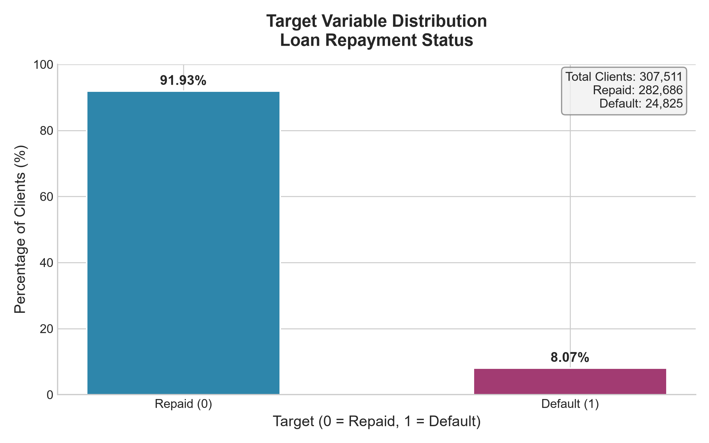

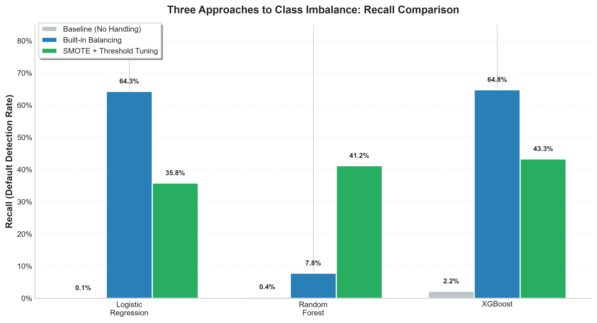

---

## Key Finding

> **Built-in class balancing (`scale_pos_weight`) significantly outperforms SMOTE for XGBoost**
> (64.4% vs 45.4% recall, p < 0.000001) — a counterintuitive result challenging conventional wisdom.

| Metric | Value | Interpretation |
|--------|-------|----------------|
| **Recall** | 64.8% | Catches ~65% of defaulters |
| **ROC-AUC** | 75.5% | Good discrimination between classes |
| **Statistical Significance** | p < 0.000001 | McNemar's exact test |
| **Cross-Validation Recall** | 64.1% ± 0.7% | Stable across 5 folds |

---

## Methodology

```
Raw Data (307K) → EDA → Feature Engineering (192 features) → 3 Approaches × 3 Models → Best Model Selection → Statistical Validation → SHAP Explainability
```

**Three approaches to class imbalance:**
1. **Baseline** — No handling (default threshold = 0.5)
2. **Built-in Balancing** — `class_weight='balanced'` / `scale_pos_weight` (default threshold = 0.5)
3. **SMOTE + Threshold Tuning** — Synthetic oversampling + PR-curve optimal threshold

---

## Results

### Full Comparison

| Model | Approach | Recall | Precision | F1-Score | ROC-AUC |
|-------|----------|--------|-----------|----------|---------|
| Logistic Regression | Baseline | 0.0% | 6.2% | 0.001 | 0.675 |
| Logistic Regression | Built-in | 64.3% | 13.1% | 0.218 | 0.679 |
| Logistic Regression | SMOTE | 35.8% | 22.0% | 0.272 | 0.716 |
| Random Forest | Baseline | 0.4% | 61.1% | 0.009 | 0.719 |
| Random Forest | Built-in | 7.8% | 37.0% | 0.129 | 0.736 |
| Random Forest | SMOTE | 41.2% | 19.1% | 0.261 | 0.708 |
| **XGBoost** | **Baseline** | **2.2%** | **56.5%** | **0.042** | **0.763** |
| **XGBoost** | **Built-in** | **64.8%** | **17.8%** | **0.279** | **0.757** |
| **XGBoost** | **SMOTE** | **43.3%** | **22.9%** | **0.299** | **0.753** |

### Best Model: XGBoost with Built-in Balancing

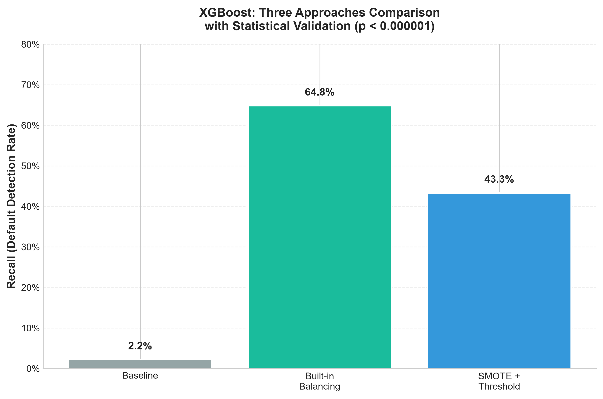

---

## Statistical Validation

### McNemar's Exact Test

| Comparison | P-value | Result |
|-----------|---------|--------|
| Baseline vs Built-in | < 0.000001 | Significant |
| Baseline vs SMOTE | < 0.000001 | Significant |
| Built-in vs SMOTE | < 0.000001 | Significant |

### 5-Fold Stratified Cross-Validation (XGBoost Built-in)

| Fold | Recall | Precision | F1-Score | ROC-AUC |
|------|--------|-----------|----------|---------|
| 1 | 63.4% | 17.3% | 0.272 | 0.751 |
| 2 | 65.5% | 17.6% | 0.278 | 0.760 |
| 3 | 63.8% | 17.5% | 0.274 | 0.752 |
| 4 | 64.3% | 17.6% | 0.276 | 0.757 |
| 5 | 63.6% | 17.4% | 0.274 | 0.753 |
| **Mean ± SD** | **64.1% ± 0.7%** | **17.5% ± 0.1%** | **0.275 ± 0.002** | **75.5% ± 0.3%** |

---

## Model Explainability (SHAP)

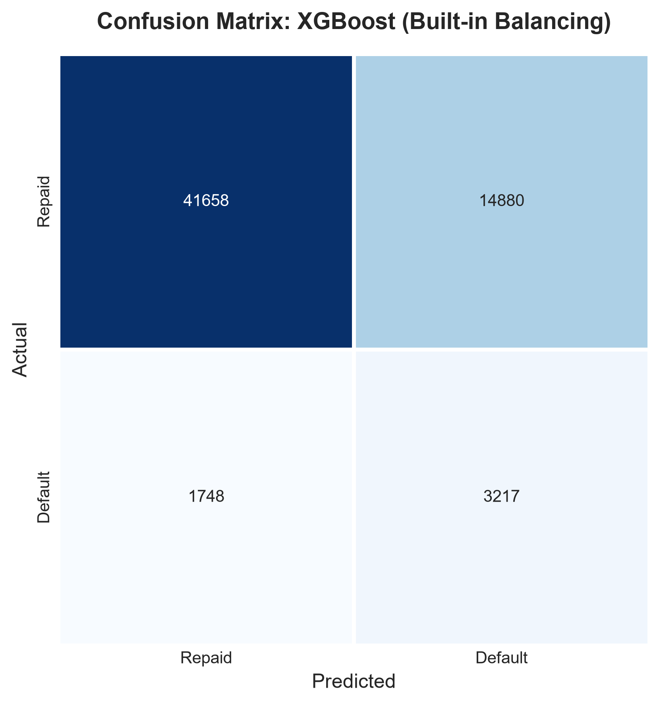

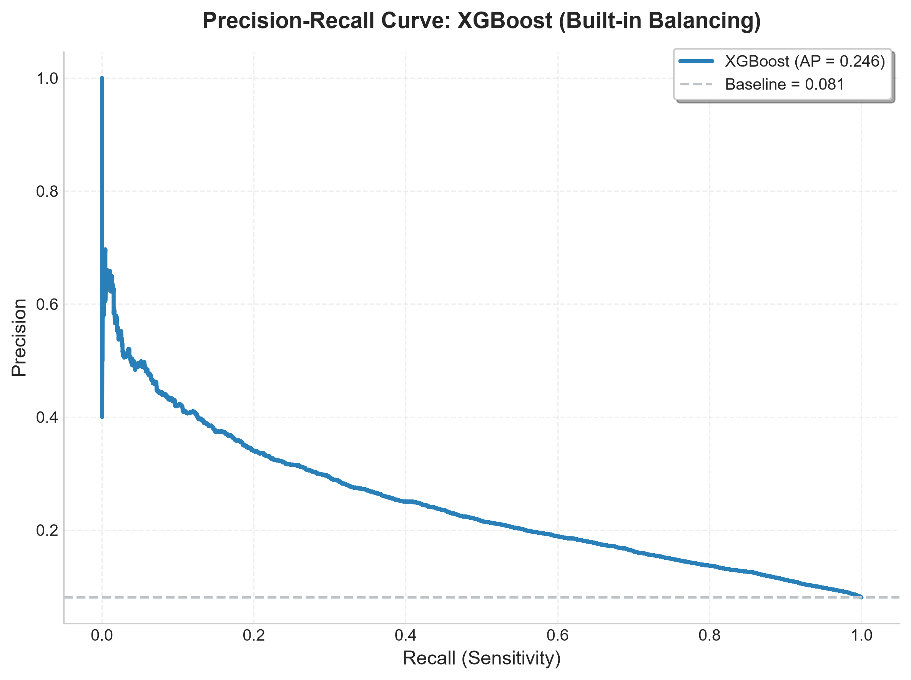

### Top Risk Drivers

| Rank | Feature | Description |
|------|---------|-------------|
| 1 | EXT_SOURCE_AVG | Average of external credit scores |
| 2 | CREDIT_TO_ANNUITY_RATIO | Loan duration (credit / annuity) |
| 3 | CODE_GENDER_M | Borrower gender |
| 4 | GOODS_TO_CREDIT_RATIO | Down payment ratio |
| 5 | AGE_YEARS | Borrower age |

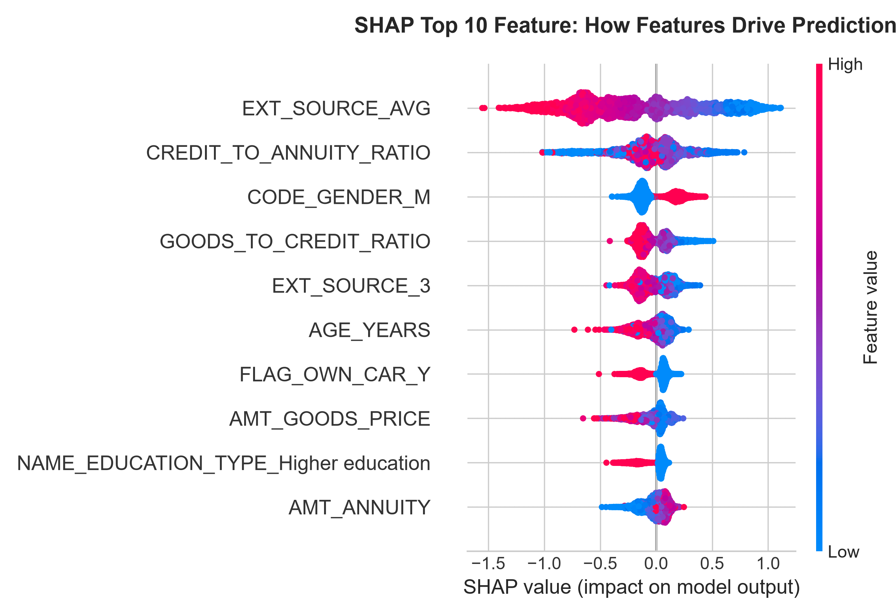

> Red = high feature value pushes toward DEFAULT. Blue = low feature value pushes toward REPAID.

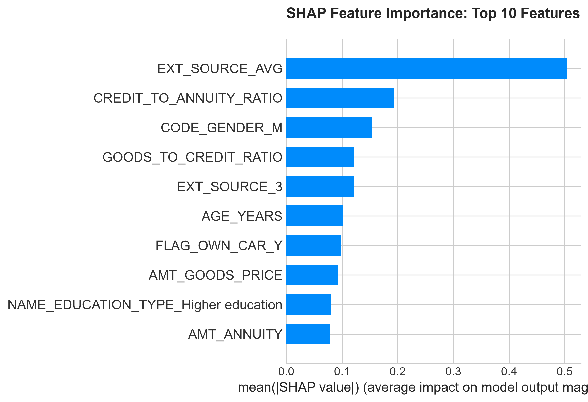

---

## EDA Visualizations

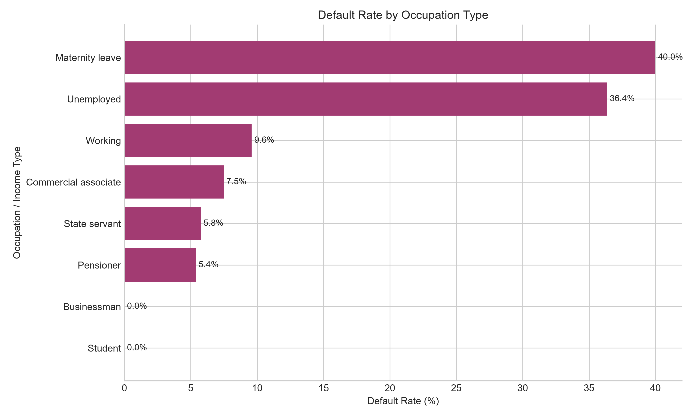

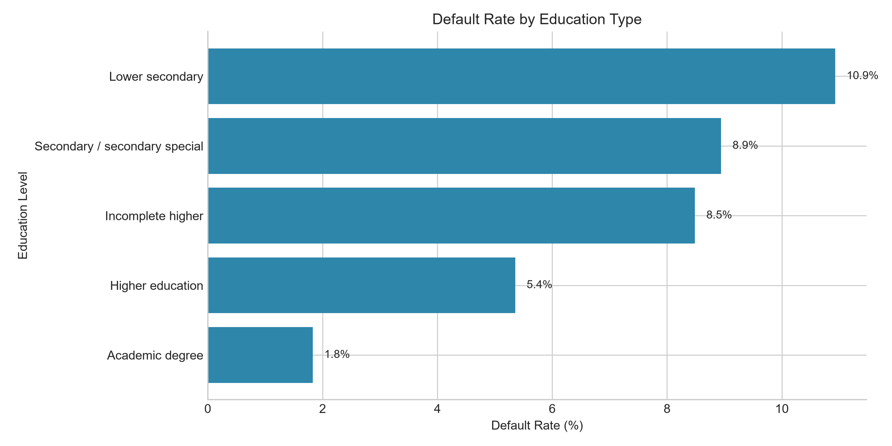

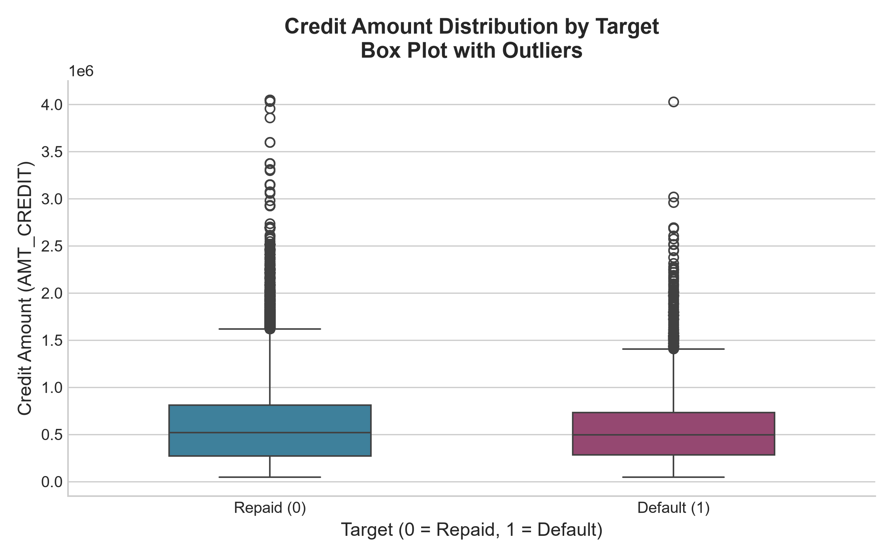

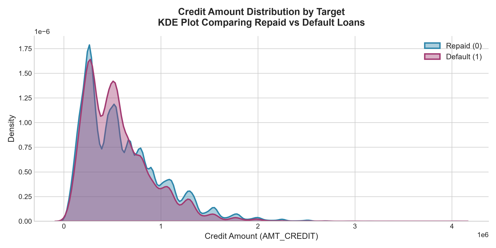

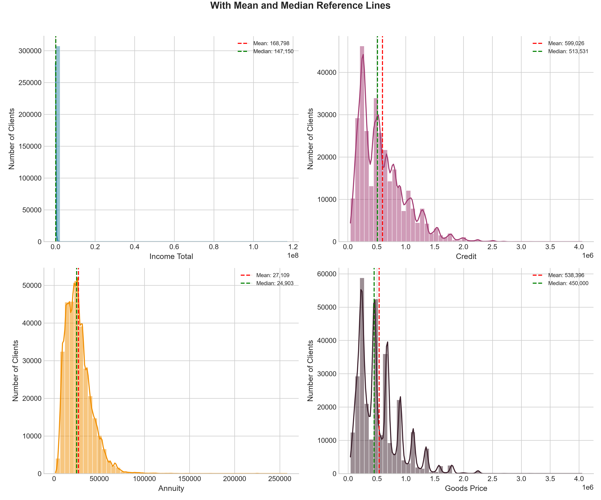

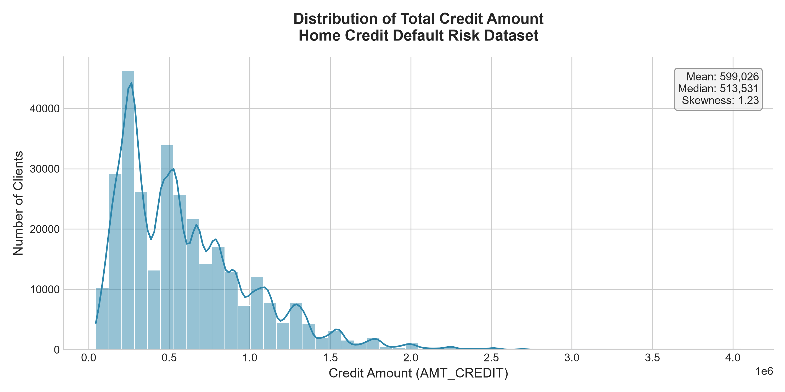

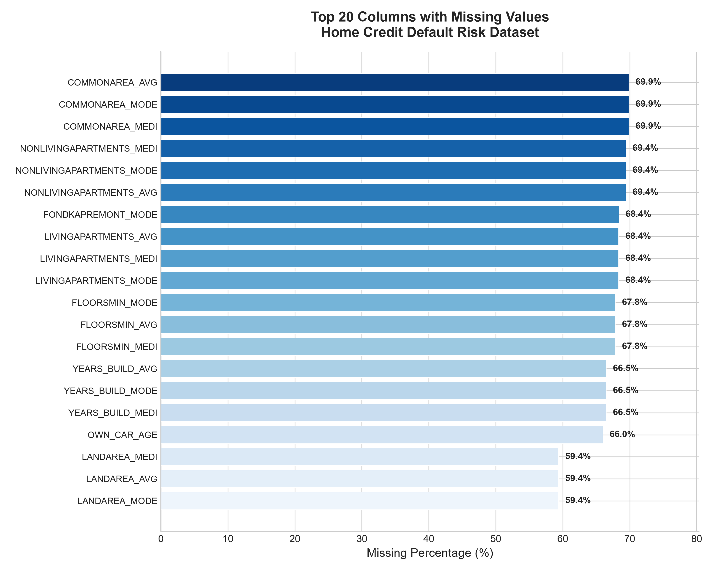

---

## Tech Stack

- **Python 3.8+**
- **pandas** — data manipulation
- **scikit-learn** — ML models, preprocessing, metrics
- **XGBoost** — gradient boosting classifier
- **imbalanced-learn** — SMOTE oversampling
- **SHAP** — model explainability
- **scipy** — McNemar's statistical test
- **matplotlib / seaborn** — visualization
